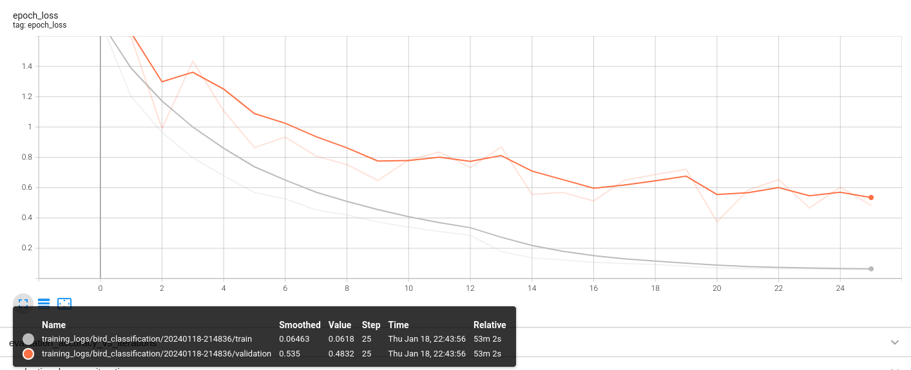

# Table of Contents

- [Table of Contents](#table-of-contents)
- [Introduction](#introduction)
  - [Project Overview](#project-overview)
  - [Purpose](#purpose)
- [Getting Started](#getting-started)
  - [Installation](#installation)
    - [Prerequisites](#prerequisites)
    - [Clone the Repository](#clone-the-repository)
    - [Create Virtual Environment (Optional)](#create-virtual-environment-optional)
    - [Install Dependencies](#install-dependencies)
  - [Project Structure](#project-structure)
  - [Dependencies](#dependencies)
- [Data preparation](#data-preparation)
  - [Data Collection](#data-collection)
    - [Dataset Information:](#dataset-information)
    - [Data Exploration:](#data-exploration)
  - [Data Augmentation](#data-augmentation)
- [Exploratory Data Analysis (EDA)](#exploratory-data-analysis-eda)
    - [Sample Images](#sample-images)
    - [Class Distribution](#class-distribution)
    - [Error Level Analysis (ELA) Images](#error-level-analysis-ela-images)
- [Model Development](#model-development)
  - [Model Architecture](#model-architecture)
  - [Training](#training)
  - [Fine-Tuning](#fine-tuning)
- [Results](#results)
  - [Prediction Example](#prediction-example)
  - [Model Performance](#model-performance)
    - [Original Model Performance](#original-model-performance)
      - [Training and Validation Accuracy](#training-and-validation-accuracy)
      - [Training and Validation Loss](#training-and-validation-loss)
    - [Fine-Tuned Model Performance](#fine-tuned-model-performance)
      - [Training and Validation Accuracy After Fine-Tuning](#training-and-validation-accuracy-after-fine-tuning)
      - [Training and Validation Loss After Fine-Tuning](#training-and-validation-loss-after-fine-tuning)
  - [Model Comparison](#model-comparison)
- [Acknowledgements](#acknowledgements)

<a id="introduction"></a>
# Introduction

<a id="project-overview"></a>
## Project Overview

Unleash your inner ornithologist with this deep learning model! Trained on 90,000+ images, it accurately identifies 525+ bird species with over 94% accuracy! Data augmentation and advanced training techniques ensure top-notch performance.

<a id="purpose"></a>
## Purpose

This is a practical application inspired by Chapter 14 of the "Hands-On Machine Learning with Scikit-Learn, Keras, and TensorFlow" book, focusing on deep computer vision using Convolutional Neural Networks (CNNs).


<a id="getting-started"></a>
# Getting Started

<a id="installation"></a>
## Installation
To get started with this project, follow the steps below for a seamless installation of dependencies.

### Prerequisites

Make sure you have the following installed on your system:

- [Python](https://www.python.org/) (>=3.6)
- [virtualenv](https://virtualenv.pypa.io/) (for creating isolated Python environments) (Optional)

### Clone the Repository

```bash
git clone https://github.com/MohamedSamir245/Bird_Classification
cd your_project
```

### Create Virtual Environment (Optional)
```
# Create a virtual environment
virtualenv venv

# Activate the virtual environment
# On Windows
.\venv\Scripts\activate
# On macOS/Linux
source venv/bin/activate
```

### Install Dependencies
```
make requirements
```

<a id="project-structure"></a>
## Project Structure

    base
    |
    ├── Makefile           <- Makefile with commands like `make data` or `make train`
    ├── README.md          <- The top-level README for developers using this project.
    ├── data
    │   ├── external       <- Data from third party sources.
    │   ├── interim        <- Intermediate data that has been transformed.
    │   ├── processed      <- The final, canonical data sets for modeling.
    │   └── raw            <- The original, immutable data dump.
    │
    ├── docs               <- A default Sphinx project; see sphinx-doc.org for details
    │
    ├── models             <- Trained and serialized models, model predictions, or model summaries
    │
    ├── notebooks          <- Jupyter notebooks. Naming convention is a number (for ordering),
    │                         the creator's initials, and a short `-` delimited description, e.g.
    │                         `1.0-jqp-initial-data-exploration`.
    │
    ├── references         <- Data dictionaries, manuals, and all other explanatory materials.
    │
    ├── reports            <- Generated analysis as HTML, PDF, LaTeX, etc.
    │   └── figures        <- Generated graphics and figures to be used in reporting
    │
    ├── requirements.txt   <- The requirements file for reproducing the analysis environment, e.g.
    │                         generated with `pip freeze > requirements.txt`
    │
    ├── setup.py           <- makes project pip installable (pip install -e .) so src can be imported
    ├── src                <- Source code for use in this project.
    │   ├── __init__.py    <- Makes src a Python module
    │   │
    │   ├── data           <- Scripts to download or generate data
    │   │   ├── explore.py
    │   │   ├── functions.py
    │   
    │   ├── models         <- Scripts to train models and then use trained models to make
    │   │   │                 predictions
    │   │   ├── predict_model.py
    │   │   └── train_model.py
    │   │
    |   ├── helper_functions.py
    |   |
    │   └── visualization  <- Scripts to create exploratory and results oriented visualizations
    │       └── visualize_results.py
    │
    └── tox.ini            <- tox file with settings for running tox; see tox.readthedocs.io


<a id="dependencies"></a>
## Dependencies

The following dependencies are required to run this project. Make sure to install them before getting started:

- [darkdetect==0.8.0](https://pypi.org/project/darkdetect/)
- [keras_preprocessing==1.1.2](https://pypi.org/project/keras-preprocessing/)
- [PyGObject==3.42.1](https://pypi.org/project/PyGObject/)
- [pytest==7.4.4](https://pypi.org/project/pytest/)
- [scikit_learn==1.4.0](https://pypi.org/project/scikit-learn/)
- [seaborn==0.13.1](https://pypi.org/project/seaborn/)
- [setuptools==68.2.2](https://pypi.org/project/setuptools/)
- [tkinterDnD==0.0.0](https://pypi.org/project/tkinterDnD/)
- [traitlets==5.14.1](https://pypi.org/project/traitlets/)
- [typing_extensions==4.9.0](https://pypi.org/project/typing-extensions/)

<a id="data-preparation"></a>
# Data preparation

<a id="data-collection"></a>
## Data Collection

The dataset used in this project was obtained from Kaggle. It consists of approximately 90,000 images, generously provided by Kaggle, covering a diverse range of bird species.

### Dataset Information:

- **Source**: Kaggle
- **Dataset URL**: [BIRDS 525 SPECIES- IMAGE CLASSIFICATION](https://www.kaggle.com/datasets/gpiosenka/100-bird-species)
- **Number of Images**: ~90,000
- **Number of Bird Species**: 525

### Data Exploration:

Before diving into the model development, a thorough exploration of the dataset was conducted to understand its structure, the distribution of bird species, and potential challenges. Exploratory Data Analysis (EDA) insights can be found in the [Exploratory Data Analysis](#exploratory-data-analysis) section.

Make sure to download the dataset from the provided Kaggle URL before running the code in this repository.


## Data Augmentation

To enhance the model's generalization capabilities and mitigate overfitting, data augmentation techniques were applied to the training dataset. The following transformations were incorporated into the data augmentation pipeline:

```python
data_augmentation = tf.keras.Sequential([
    tf.keras.layers.RandomFlip(mode="horizontal", seed=42),
    tf.keras.layers.RandomRotation(factor=0.05, seed=42),
    tf.keras.layers.RandomZoom(0.05, seed=42),
])
```


# Exploratory Data Analysis (EDA)


### Sample Images
Below are sample images from the dataset, providing a visual representation of the input data:


### Class Distribution
To understand the class distribution and assess the balance of the dataset, the distribution of the top 20 labels is visualized in the figure below:


### Error Level Analysis (ELA) Images
Error Level Analysis (ELA) images were generated to observe the impact of changing image quality on the dataset. The figure below displays ELA images for a subset of the dataset:


# Model Development

## Model Architecture

The core architecture of the model is based on the Inception_V3 neural network, a powerful convolutional neural network (CNN) commonly used for image classification tasks. Below is an overview of the architecture:

```plaintext
    Model: "sequential_1"
_________________________________________________________________
 Layer (type)                Output Shape              Param #   
=================================================================
 sequential (Sequential)     (None, 224, 224, 3)       0         
                                                                 
 inception_v3 (Functional)   (None, None, None, 2048)  21802784  
                                                                 
 global_average_pooling_laye  (None, 2048)             0         
 r (GlobalAveragePooling2D)                                      
                                                                 
 output-layer (Dense)        (None, 525)               1075725   
                                                                 
=================================================================
Total params: 22,878,509
Trainable params: 1,075,725
Non-trainable params: 21,802,784
_________________________________________________________________
```

## Training

The model underwent an initial training phase using the provided dataset. The training process incorporated several key aspects to ensure optimal model performance:

- **Data Augmentation:** To boost the model's generalization capabilities, various data augmentation techniques were applied during the training phase.

- **Checkpoint:** A checkpoint callback was implemented to save the best model configuration after the completion of each training epoch.

- **Early Stopping:** A mechanism was in place to terminate the training process if there was no improvement in the validation loss over a specified number of epochs.

- **Reduced Learning Rate on Plateau:** The learning rate dynamically adjusted downwards if the validation loss reached a plateau, enhancing convergence.

- **TensorBoard:** The TensorBoard callback played a crucial role in visualizing and monitoring the training process, providing valuable insights into model behavior and performance.


## Fine-Tuning

To further enhance the model's performance, the top 22 layers of the Inception_V3 model were fine-tuned. This process involved adjusting the weights of these layers based on the specific requirements of the project.


# Results

## Prediction Example


## Model Performance

### Original Model Performance

#### Training and Validation Accuracy


#### Training and Validation Loss


### Fine-Tuned Model Performance

#### Training and Validation Accuracy After Fine-Tuning


#### Training and Validation Loss After Fine-Tuning


## Model Comparison

Comparing the performance of the original model and the fine-tuned model reveals insights into the effectiveness of the fine-tuning process. The figures above depict the accuracies and losses for both models over epochs, providing a visual representation of their respective performances.

# Acknowledgements

This project wouldn't have been possible without the support, guidance, and contributions from various individuals and organizations. I would like to express my gratitude to:

- **Author of "Hands-On Machine Learning with Scikit-Learn, Keras, and TensorFlow":** For providing a comprehensive resource that served as the foundation for this project.

- **Kaggle Community:** For providing the dataset used in this project and fostering a collaborative environment for data science enthusiasts.
